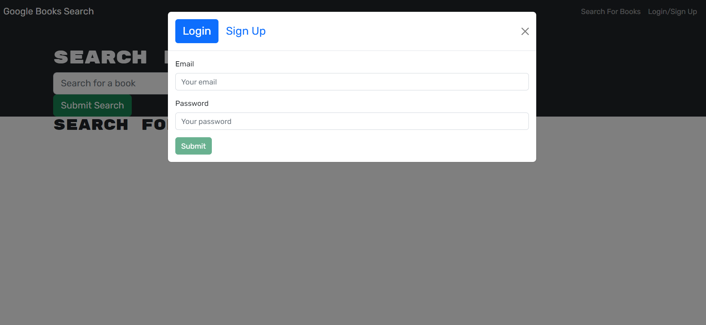
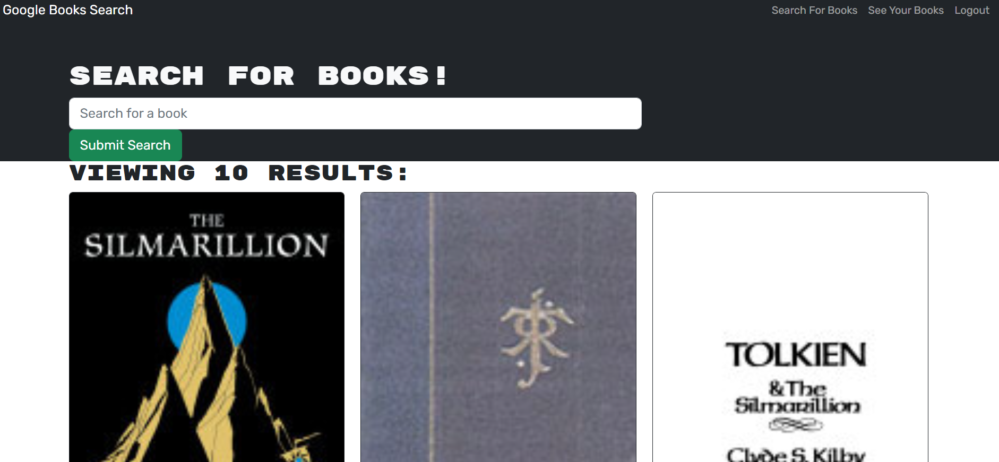
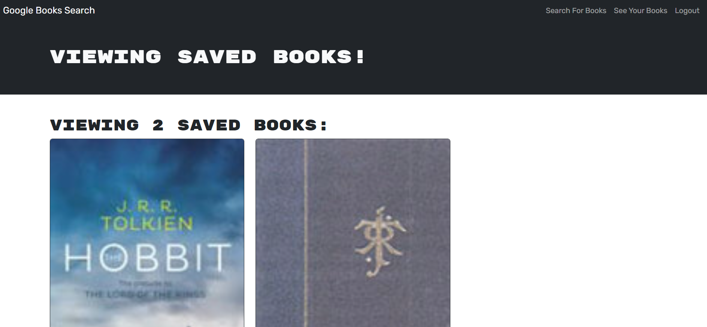

# Book Search Engine

## Link to deployed website:

https://levis-book-search.herokuapp.com/

## Images of website:

## Description

For this assignment, I refactored a website to use graphql. 

My biggest hurdle for this assignment was my mutations and queries. I did not test them after writing them because I could not figure out how to use graphql playground. For other projects, I used sandbox, and it was easy to use. So when I implemented queires/mutations on the front-end, the problems were usually issues with the back-end, which would have never been there if I tested them as I was writing them. This whole process was frustrating, but I learned a valuable lesson!

## License

The MIT License was used for this assignment.